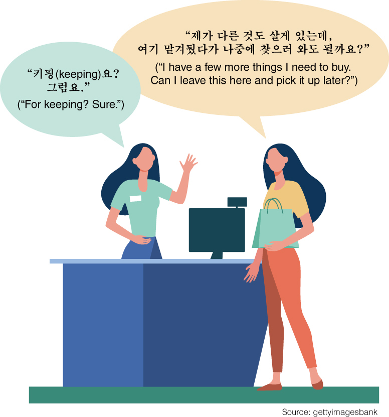
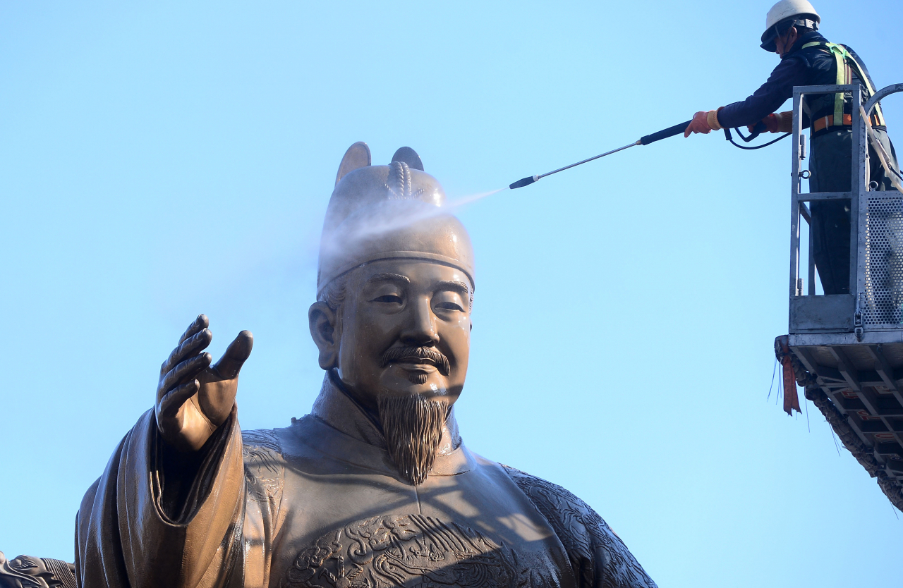

<!--
형광팬: 
text

-->
## Daily Check
- [ ] 영어기사 분석
- [ ] 알고리즘 문제 1개 이상
- [ ] 운동하기

### 영어기사
**Can the Korean language survive the invasion of English loanwords?**

When a North Korean defector fled back to the North after jumping over the heavily fortified inter-Korean border fence in January, many headlines described the incident as a “jump defection.”

Though a similar incident has occurred in the past, the use of the term became widespread in the media only this month, according to Google Trends. “Gaslighting,” loosely defined as the act of making someone question their reality by manipulating facts, also skyrocketed in usage early last year, the Google website showed, as the phrase began to enjoy media exposure in Korea, in the context of dating in particular.

The English word “waiting” has been used in South Korea’s service sector for years, despite the existence of the Korean verb “gidarida” which means “to wait.” And in recent years, the use of “keeping” has been on the rise, referring to the act of shops holding an item for customers.

The pandemic has accelerated the trend, bringing in a cluster of new loanwords related to COVID, said researcher Park Joo-hwa at the National Institute of Korean Language, an institution affiliated with the Ministry of Culture, Sports and Tourism.

“COVID-related jargon is becoming more mainstream -- terminologies that most people wouldn’t normally use are being more commonly used in the context of social distancing and testing,” Park said.

The institute regularly issues a list of Korean alternatives to replace foreign loanwords as part of it campaign to encourage using more Korean words. One recent list includes terms such as “pandemic,” “epidemic,” “drive-through,” “travel bubble” and “long COVID” as examples.

“’Travel bubble,’ for example, can be seen as jargon and elderly people or kids who do not speak English well might not understand what travel bubbles are when they first hear them,” she said. 

A worker washes the statue of King Sejong in Gwanghwamun in April, 2020.(Lee Sang-sub/The Korea Herald)
So why do Koreans love using foreign loanwords, especially English ones?

“Some words make someone sound more ‘educated’ and other words less so,” said assistant professor of Korean linguistics at Korea University Jeffrey Holliday who teaches an undergraduate course on Korean sociolinguistics.

“Speakers can manipulate that, often even subconsciously, to make themselves sound smarter in one context, but perhaps more approachable or down-to-earth in another.”

In fitness, “cheating day” has caught on in recent years as personal trainers and fitness YouTubers embraced the term in reference to a day off from a strict diet or exercise regimen. President Moon Jae-in’s policy to expand national health insurance coverage has also been dubbed “Moon Jae-in Care” -- a term used in official settings by the presidential office since the policy was unveiled in 2017. The name was inspired by Obamacare, a colloquial name for the Affordable Care Act which was signed into law by US President Barack Obama in 2010.

“When we look at English loanwords in Korea, I think there are a couple of common motivations for adopting them -- sometimes it’s because they sound exotic or high class. In other cases, it could be because the English word allows the speaker to avoid some negative connotation or feeling carried by the equivalent Korean word or expression,” he added.

“In yet other cases, it could be because although an equivalent Korean word or expression could exist, the English word might just be shorter, and thus perceived as more convenient by some. It could also be a combination of these factors.”

There has been pushback against the widespread use of loanwords from linguistic puritans, however, including the National Institute of Korean Language. One of the institute’s main jobs is to encourage the use of Korean words over foreign loanwords.

But researcher Park explained the institute’s goal has moved on from keeping the Korean language “pure” to tackling more practical issues such as breaking language barriers between different generations and demographics.

“At the beginning, our project to refine the Korean language was designed to remove Japanese influence following the liberation from the Japanese occupation in 1945.

“Given the historical background, many people were on board at that time,” Park said.

But the focus has shifted as of late as recent loanwords -- many of them from Western languages including English -- have not been introduced by coercion, the researcher explained.

“We are aware of the view that these loanwords are just a sign of times -- so instead of ‘purifying’ the language, we are more focusing on ensuring smooth communication.”

Park said foreign loanwords can create communication problems between generations and social groups.

“When jargon or loanwords are used in official settings or by the media, people who are unfamiliar with a particular field of work might not understand them.”

The cultural links between the US and South Korea are also driving the use of English loanwords, according to Holliday.

Though Korea and China have strong cultural links too, he notes that these links are more historical than contemporary, which helps explain why the majority of Chinese-origin loanwords in Korean are much older. The difference, he suspects, is that such words were brought into Korean by scholars who were educated on Chinese classics or Buddhist texts, not by the youth of the time who were trying to sound cool.

“When a new English loanword is adopted into Korean, the Korean speaker who adopted it had to get it from somewhere, which means they had to have consumed some media or had some contact with an English speaker. So you’re only going to get loanwords from a language when enough people are engaging with the language in some form.”

While some are concerned by the foreign loanwords that are flooding in, professor Holliday said they are not “replacing” the Korean words.

“’Waiting’ doesn‘t replace ‘gidarida’ in general but only in a restaurant or service context. Many people don’t view it that way, but they can also be viewed as enriching the language.”

By Yim Hyun-su (hyunsu@heraldcorp.com)

#### 단어암기

- enrich: 질을 높이다; (더) 부유하게 만들다
- scholar: 학자; 장학생; 모범생
- coercion: (무력.협박에 의한) 강제[강압]
- liberate: 해방시키다
- demographic: 인구 (통계)학의
- tackle: (힘든 문제상황과) 씨름하다; (문제힘든 상황에 대해) 솔직하게 말하다[따지다]
- puritan: 청교도적인 사람, 철저한 금욕주의자
- equivalent: (가치, 의미, 중요도 등이) 동등한[맞먹는]
- denotation: (단어를 통한) 지시; 명시적 의미
- connotation: 함축(된 의미)
- adopt: 입양하다; (정책 등을 투표로) 채택하다
- colloquial: 구어의, 일상적인 대화체의
- dub: 별명을 붙이다; (영화 등을 다른 언어로) 재녹음하다[더빙하다]
- regimen: 식이 요법
- embrace: (껴)안다, 포옹하다; 받아들이다
- down-to-earth: 현실적인, 실제적인; 세상 물정에 밝은
- approachable: 말을 붙이기 쉬운, 이해하기 쉬운; 접근 가능한
- subconsciously: 잠재 의식적으로, 반 무의식적으로
- sociolinguistics: 사회 언어학
- assistant: 조수, 보조원
- terminology: (집합적인) 전문 용어
- jargon: (특정 분야의 전문 특수) 용어
- flee: 달아나다, 도망가다
- affliated: 소속된, 연계된
- skyrocket: 급등하다
- fortify: 요새화하다; 용기를 돋우다; (감정, 태도) 강화하다
- defector: 탈주자, 배반자, 망명자
- loanword: 외래어
- invasion: (적군) 침략(침입); 침해
- manipulate: 조종하다; 다루다
- inspired: ...의 영향을 (받았음을) 드러내는; 영감을 받아 한, 직관에 따른
- pushback: (계획.변화 등에 대한) 반발
